# ◈ NOVA

## The AI Executive Layer for Modern Commerce

> **NOVA turns business questions into explainable decisions, controlled actions, and auditable outcomes.**

NOVA is a multi-agent business intelligence and **agentic commerce** platform built around one idea:

**Business intelligence should not end at an answer. It should help a business decide what to do — while keeping consequential actions explainable, bounded, gated, and auditable.**

```text
ASK
 ↓
ROUTE
 ↓
REASON
 ↓
ANALYZE
 ↓
RECOMMEND
 ↓
PROPOSE
 ↓
VALIDATE
 ↓
APPROVE / REJECT
 ↓
EXECUTE
 ↓
AUDIT
```

The result is an AI executive layer that brings specialist business intelligence into one environment.

---

# ◈ 01 — PRODUCT VISION

## The problem

Modern businesses already have data.

The difficulty is turning that data into a coordinated decision.

Marketing understands campaigns and ROAS.

Sales understands customers and revenue.

Finance understands profitability.

Inventory understands stock and operational risk.

The executive is still responsible for connecting all of those signals.

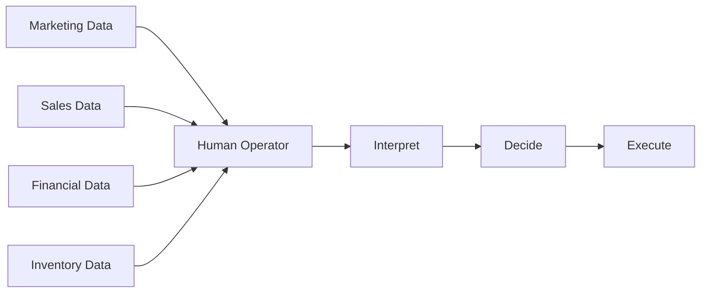

### The opportunity

NOVA introduces an AI executive layer between business data and business action.

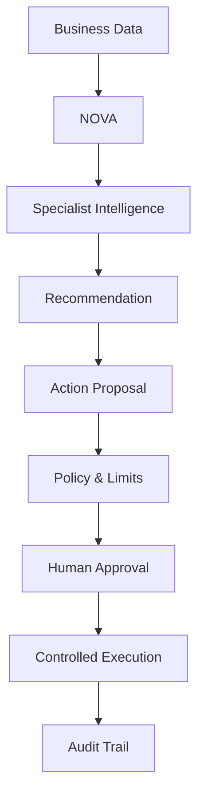

---

# ◈ 02 — PRODUCT REQUIREMENT

## Core product statement

> **NOVA should allow an executive to ask a business question in natural language, receive evidence-backed reasoning from the appropriate specialist agent, and — where action is appropriate — review, approve, reject, and audit a bounded operational action.**

## Product goals

### G1 — Unified intelligence

Give a business one interface for cross-functional questions.

### G2 — Specialist reasoning

Use domain-specific agents rather than one monolithic business prompt.

### G3 — Actionability

Move from observation and recommendation toward controlled action.

### G4 — Human control

Require explicit approval before consequential executable actions.

### G5 — Explainability

Expose the reasoning, supporting business evidence, proposed action, and execution result.

### G6 — Reliability

Treat rejection, validation failure, and execution failure as explicit system states.

### G7 — Auditability

Maintain a traceable history of action lifecycle events.

---

# ◈ 03 — USER EXPERIENCE

NOVA is presented as an interactive **executive boardroom**.

The interface is intentionally cinematic.

The boardroom is not merely decoration: it represents the underlying organizational model.

```text
                         ┌─────────────────┐
                         │      NOVA       │
                         │ AI EXECUTIVE    │
                         └────────┬────────┘
                                  │
        ┌─────────────────────────┼─────────────────────────┐
        │                         │                         │
   ┌────▼─────┐              ┌────▼─────┐              ┌────▼─────┐
   │ MARKETING│              │  FINANCE │              │  SALES   │
   └──────────┘              └──────────┘              └──────────┘
        │                         │                         │
        └─────────────────────────┼─────────────────────────┘
                                  │
                            ┌─────▼─────┐
                            │ INVENTORY │
                            └───────────┘
```

The interaction model is:

```text
Executive asks
      ↓
Relevant agent is focused
      ↓
Agent analyzes the business
      ↓
NOVA explains the result
      ↓
If an action is appropriate:
      ↓
Action proposal appears
      ↓
Executive approves / rejects
      ↓
System records the outcome
```

---

# ◈ 04 — SPECIALIST AGENTS

NOVA currently organizes intelligence around specialist business domains.

| Agent | Responsibility | Example |
|---|---|---|
| CEO | Strategy, cross-functional decisions, ambiguous questions | “Should NOVA aggressively scale the business?” |
| Marketing | Campaigns, advertising, ROAS, spend, channels | “What is our ROAS?” |
| Sales | Revenue, customers, products, segments, AOV, LTV | “Which customer segment generates the most revenue?” |
| Finance | Profit, expenses, costs, margins, cash | “What is our operating profit?” |
| Inventory | Stock, replenishment, stockout risk, turnover | “Which products are low stock?” |

---

# ◈ 05 — INTELLIGENT ROUTING

The router determines which specialist handles a question.

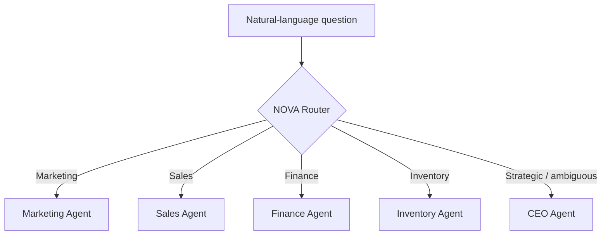

The router keeps domain reasoning separated while allowing the system to grow with new agents.

### Example

```text
"What is our ROAS?"
        ↓
Marketing Agent
        ↓
overall_roas tool
        ↓
Evidence-backed answer
```

---

# ◈ 06 — INTELLIGENCE ARCHITECTURE

The intelligence path is deliberately separated from the action path.

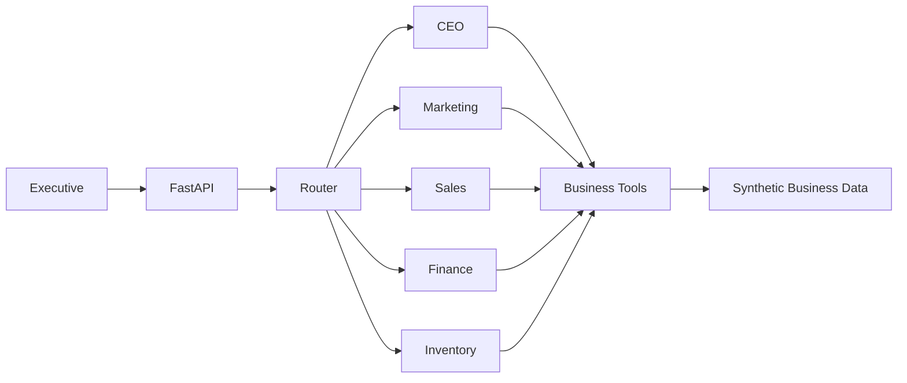

The data flow is:

**Question → Routing → Specialist Agent → Tools → Business Data → Reasoning → Answer**

---

# ◈ 07 — AGENTIC COMMERCE ARCHITECTURE

The central design principle is:

> **The model can recommend. The application controls whether an action is allowed. The human authorizes it. The executor performs it.**

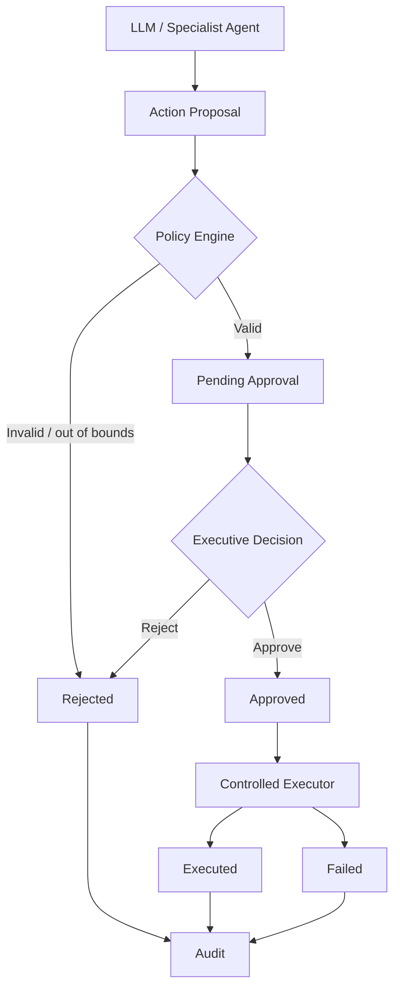

This separation prevents an LLM from becoming an unrestricted financial actuator.

---

# ◈ 08 — ACTION LIFECYCLE

Executable actions have explicit states.

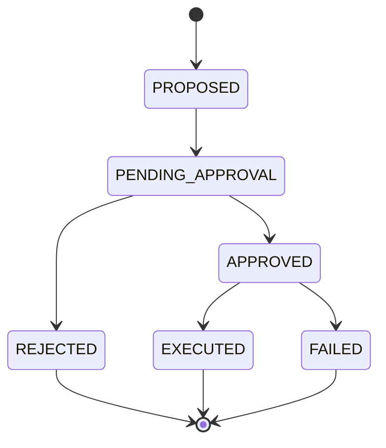

| Status | Meaning |
|---|---|
| `PROPOSED` | An agent created an action proposal |
| `PENDING_APPROVAL` | The proposal passed policy validation and requires approval |
| `APPROVED` | An executive approved the action |
| `REJECTED` | An executive rejected the action |
| `EXECUTED` | The action completed successfully |
| `FAILED` | Execution was attempted but did not complete |

---

# ◈ 09 — POLICY & BOUNDARIES

The policy layer creates deterministic boundaries around AI-generated proposals.

```text
                   ACTION PROPOSAL
                         │
                         ▼
                 ┌───────────────┐
                 │ POLICY ENGINE │
                 └───────┬───────┘
                         │
            ┌────────────┼────────────┐
            ▼            ▼            ▼
        Amount         Source     Destination
         checks        checks        checks
            │            │            │
            └────────────┼────────────┘
                         ▼
                   VALID / INVALID
```

A proposal may be rejected before it reaches the human approval stage.

The policy layer is independent from the LLM.

That distinction matters:

```text
AI reasoning = probabilistic
Policy enforcement = deterministic
```

---

# ◈ 10 — HUMAN-IN-THE-LOOP

A consequential action cannot jump directly from model output to execution.

```text
Agent recommendation
        ↓
Action proposal
        ↓
Policy validation
        ↓
┌───────────────────────────────┐
│       EXECUTIVE GATE          │
│                               │
│   [ REJECT ]   [ APPROVE ]    │
└───────────────────────────────┘
        ↓
     Decision
```

The approval boundary is enforced in the backend action lifecycle, not merely presented as a frontend button.

---

# ◈ 11 — EXECUTION SAFETY

The executor itself verifies authorization.

```python
if action.status != ActionStatus.APPROVED:
    raise ActionExecutionError(
        "Only approved actions can be executed."
    )
```

Therefore:

```text
PENDING_APPROVAL → execute   ✕
REJECTED         → execute   ✕
APPROVED         → execute   ✓
```

This gives NOVA a defense-in-depth model:

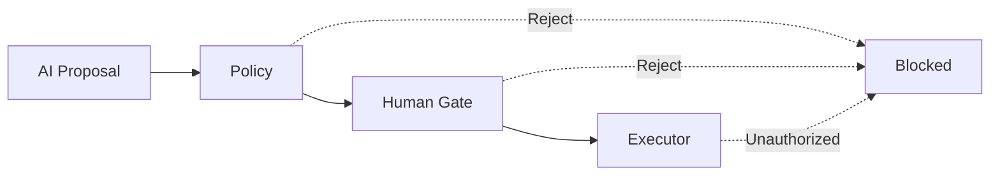

---

# ◈ 12 — FAILURE HANDLING

Failure is treated as an explicit outcome rather than an exception that disappears into logs.

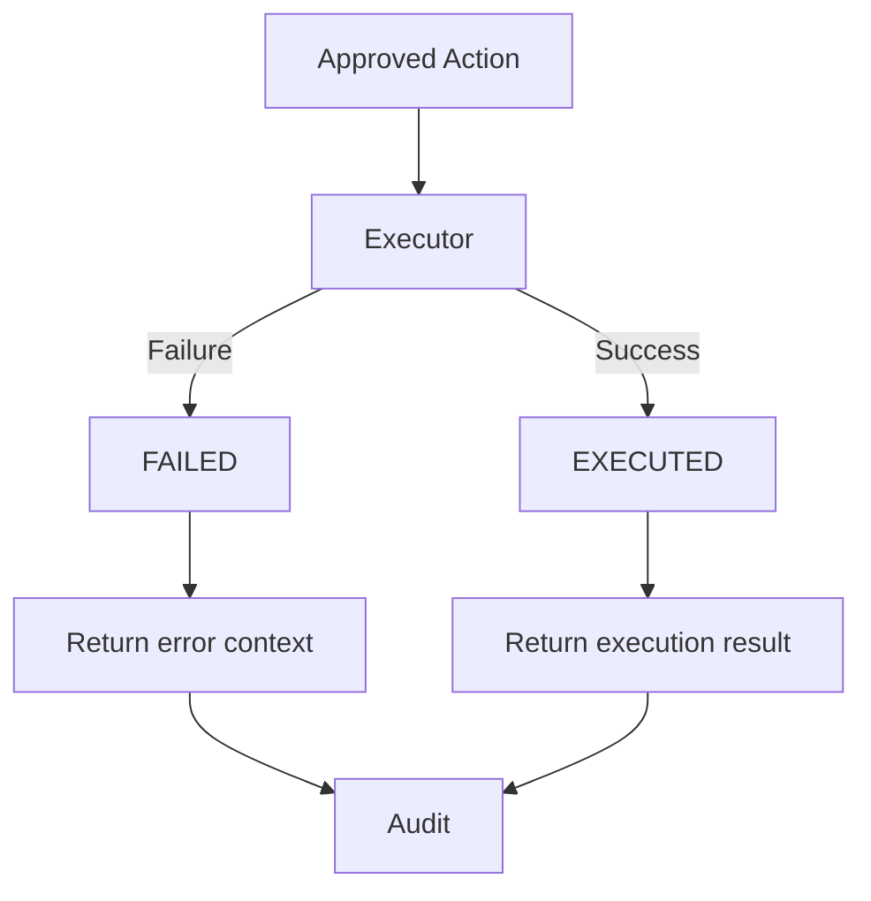

Example:

```text
EXECUTION FAILED

Reason:
Marketing reallocation requires a destination.

No action was performed.

Status:
FAILED
```

This is important for real agentic systems where downstream services can reject or fail requests.

---

# ◈ 13 — AUDIT TRAIL

NOVA records lifecycle events for executable actions.

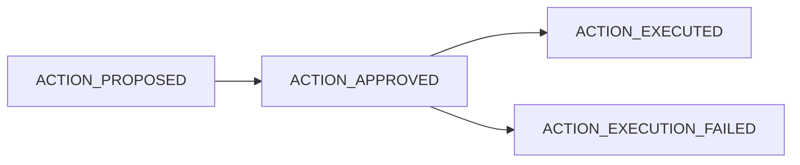

Each event carries:

- event ID
- action ID
- event type
- status
- message
- timestamp

Example:

```text
ACTION_PROPOSED
      │
      │  timestamp
      ▼
ACTION_APPROVED
      │
      │  timestamp
      ▼
ACTION_EXECUTED
      │
      │  timestamp
      ▼
AUDIT COMPLETE
```

---

# ◈ 14 — DECISION HISTORY

NOVA separates **business intelligence** from **executive decisions**.

### Intelligence

> “What should we do?”

### Decision

> “What did the executive authorize?”

The interface surfaces approved and rejected decisions as a decision history.

```text
DECISION HISTORY

✓ APPROVED
Increase marketing spend

MARKETING AGENT

✕ REJECTED
Pause Campaign B

MARKETING AGENT
```

The current prototype keeps this state in memory.

Persistent storage can be introduced without changing the surrounding decision-control architecture.

---

# ◈ 15 — SYSTEM DESIGN

## High-level system

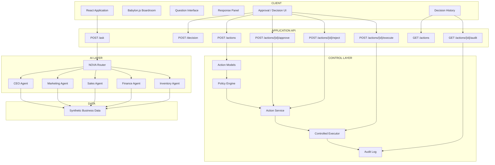

---

# ◈ 16 — FRONTEND ARCHITECTURE

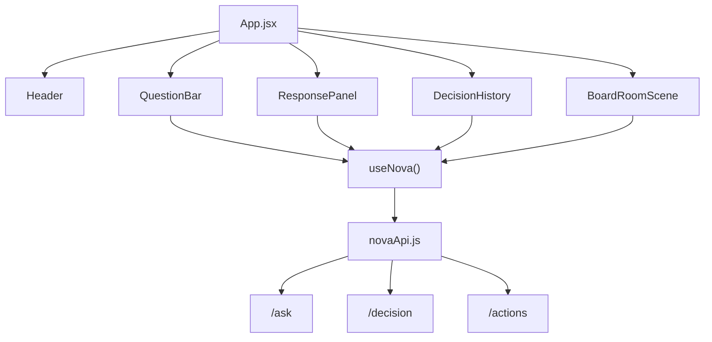

### Frontend responsibilities

**App.jsx**
- composition
- high-level state connection

**useNova**
- API orchestration
- loading state
- answer state
- decision state
- decision history state

**novaApi**
- HTTP boundary

**ResponsePanel**
- intelligence presentation
- approval controls

**DecisionHistory**
- recorded decisions

**BoardRoomScene**
- 3D environment
- agent focus
- camera movement

---

# ◈ 17 — BACKEND ARCHITECTURE

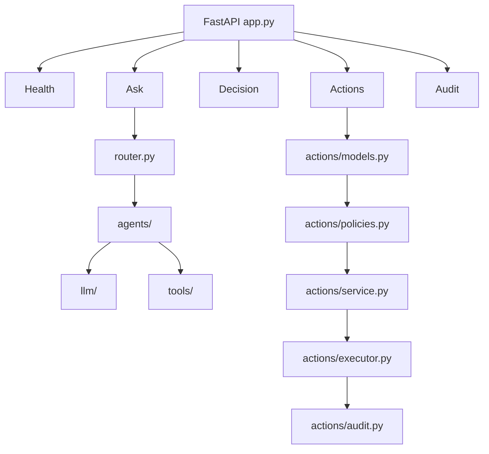

---

# ◈ 18 — REPOSITORY STRUCTURE

```text
NOVA/
│
├── frontend/
│   ├── src/
│   │   ├── api/
│   │   ├── components/
│   │   ├── hooks/
│   │   └── scenes/
│   ├── package.json
│   └── package-lock.json
│
├── src/
│   └── nova/
│       ├── agents/
│       │   ├── ceo_orchestrator.py
│       │   ├── marketing_agent.py
│       │   ├── sales_agent.py
│       │   ├── finance_agent.py
│       │   └── inventory_agent.py
│       │
│       ├── actions/
│       │   ├── models.py
│       │   ├── policies.py
│       │   ├── service.py
│       │   ├── executor.py
│       │   └── audit.py
│       │
│       ├── api/
│       │   └── app.py
│       │
│       ├── llm/
│       │   └── client.py
│       │
│       ├── tools/
│       │
│       └── router.py
│
├── data/
│   └── synthetic/
│
├── scripts/
│
├── tests/
│   └── test_backend.py
│
├── main.py
├── pyproject.toml
├── requirements.txt
├── .gitignore
└── README.md
```

---

# ◈ 19 — TECHNOLOGY STACK

| Layer | Technology |
|---|---|
| Frontend | React |
| Build Tool | Vite |
| 3D Environment | Babylon.js |
| Backend | Python |
| API | FastAPI |
| Data Validation | Pydantic |
| LLM Abstraction | LiteLLM |
| Intelligence | Multi-agent architecture |
| Action Control | Policy + Action Service |
| Execution | Controlled sandbox executor |
| Testing | Python integration tests |

---

# ◈ 20 — API CONTRACT

## Intelligence

### `POST /ask`

Submit a business question.

```json
{
  "question": "What is our ROAS?"
}
```

Response:

```json
{
  "question": "What is our ROAS?",
  "agent": "marketing",
  "answer": "..."
}
```

---

## Executive decision

### `POST /decision`

Record an approval or rejection decision.

```json
{
  "question": "Should we increase marketing spend?",
  "agent": "marketing",
  "action": "approved"
}
```

---

## Action lifecycle

### `POST /actions`

Create an executable action proposal.

### `GET /actions`

Retrieve action/decision history.

### `GET /actions/{action_id}`

Retrieve an individual action.

### `POST /actions/{action_id}/approve`

Approve a pending action.

### `POST /actions/{action_id}/reject`

Reject a pending action.

### `POST /actions/{action_id}/execute`

Execute an approved action.

### `GET /actions/{action_id}/audit`

Retrieve the action lifecycle audit trail.

---

# ◈ 21 — EXAMPLE ACTION

A marketing action proposal can take this form:

```json
{
  "action_type": "reallocate_marketing_budget",
  "description": "Move budget from an underperforming channel to a stronger-performing channel.",
  "amount": 50000,
  "source": "Meta Ads",
  "destination": "Google Ads",
  "reason": "Google Ads is producing stronger return performance."
}
```

It enters:

```text
PENDING_APPROVAL
```

before execution.

```text
┌──────────────────────────────────────────────┐
│              ACTION PROPOSAL                │
│                                              │
│  REALLOCATE MARKETING BUDGET                 │
│                                              │
│  ₹50,000                                     │
│                                              │
│  Meta Ads ───────────────► Google Ads        │
│                                              │
│  Reason: stronger return performance         │
│                                              │
│       [ REJECT ]      [ APPROVE ACTION ]     │
└──────────────────────────────────────────────┘
```

---

# ◈ 22 — TESTING & VERIFICATION

NOVA includes an integration test suite covering the backend lifecycle.

## Verified areas

```text
✓ Health endpoint
✓ Request validation
✓ Agent routing
✓ Agent response
✓ Action creation
✓ Action retrieval
✓ Execution safety
✓ Approval
✓ Execution
✓ Rejection
✓ Decision history
✓ Invalid decisions
✓ Audit trail
```

The test suite also explicitly verifies safety behavior:

```text
PENDING_APPROVAL → EXECUTE
                  ↓
                FAILED

REJECTED → EXECUTE
          ↓
        FAILED

APPROVED → EXECUTE
          ↓
       EXECUTED
```

### Run the suite

```bash
python tests/test_backend.py
```

Expected result:

```text
============================================================
NOVA BACKEND INTEGRATION TEST
============================================================

                    ALL TESTS PASSED

============================================================
```

---

# ◈ 23 — QUICK START

## Backend

Create a virtual environment:

```bash
python -m venv .venv
```

Activate it:

### macOS / Linux

```bash
source .venv/bin/activate
```

Install dependencies:

```bash
pip install -r requirements.txt
```

Configure the required environment variables.

Start the API:

```bash
PYTHONPATH=src uvicorn nova.api.app:app --reload
```

Backend:

```text
http://127.0.0.1:8000
```

---

## Frontend

```bash
cd frontend
npm install
npm run dev
```

---

# ◈ 24 — DEMO SCRIPT

A strong NOVA demonstration follows the same story as the product architecture.

### Scene 01 — Ask

The executive asks:

> **“What is our ROAS?”**

NOVA routes the request to Marketing.

---

### Scene 02 — Investigate

The Marketing Agent uses its business tools and returns evidence-backed intelligence.

---

### Scene 03 — Escalate to action

The executive asks:

> **“Should we reallocate marketing budget toward higher-performing channels?”**

NOVA presents the recommendation.

---

### Scene 04 — Propose

The recommendation becomes a structured action proposal.

---

### Scene 05 — Validate

The policy layer verifies that the proposed operation stays within system boundaries.

---

### Scene 06 — Human gate

The executive sees:

```text
ACTION REQUIRED

[ REJECT ]     [ APPROVE ACTION ]
```

---

### Scene 07 — Execute

The approved action enters the controlled executor.

---

### Scene 08 — Handle failure

A deliberately failed action is surfaced as:

```text
EXECUTION FAILED

The requested action could not be completed.

No silent failure.
No hidden state.
```

---

### Scene 09 — Audit

NOVA exposes the action lifecycle and decision history.

```text
PROPOSED → APPROVED → EXECUTED

or

PROPOSED → REJECTED

or

APPROVED → FAILED
```

---

# ◈ 25 — PRODUCT REQUIREMENTS TRACEABILITY

The system can be understood through five product requirements.

| Requirement | NOVA implementation |
|---|---|
| Real business problem | Unified executive intelligence across business domains |
| Working product | React + FastAPI + multi-agent backend + 3D boardroom |
| Meaningful AI | Domain-specialized agents use business tools to reason over data |
| Actionability | Structured action proposals, policy checks, approval, execution |
| Reliability | Explicit lifecycle states, failure handling, audit trail, integration tests |

---

# ◈ 26 — DESIGN PRINCIPLES

## Explainable

A business action should have an understandable reason.

## Bounded

The system should operate within explicit limits.

## Gated

Consequential actions should require explicit human approval.

## Auditable

The system should retain a trace of what happened.

## Deterministic where it matters

Probabilistic AI should sit behind deterministic application controls.

## Failure-aware

A failure should be represented as state, not hidden as noise.

---

# ◈ 27 — WHY NOVA

Traditional business intelligence:

```text
DATA
  ↓
DASHBOARD
  ↓
HUMAN
  ↓
DECISION
  ↓
ACTION
```

NOVA:

```text
DATA
  ↓
SPECIALIST AGENTS
  ↓
REASONING
  ↓
RECOMMENDATION
  ↓
ACTION PROPOSAL
  ↓
POLICY
  ↓
HUMAN APPROVAL
  ↓
EXECUTION
  ↓
AUDIT
```

NOVA closes the loop without removing the human from consequential decisions.

---

# ◈ 28 — CURRENT IMPLEMENTATION STATUS

| Capability | Status |
|---|:---:|
| Multi-agent intelligence | ✅ |
| Agent routing | ✅ |
| LLM integration | ✅ |
| Business intelligence tools | ✅ |
| 3D executive boardroom | ✅ |
| Agent focus / camera movement | ✅ |
| Action models | ✅ |
| Policy validation | ✅ |
| Action lifecycle | ✅ |
| Human approval | ✅ |
| Rejection | ✅ |
| Controlled execution | ✅ |
| Graceful failure | ✅ |
| Decision history | ✅ |
| Audit trail | ✅ |
| Backend integration tests | ✅ |

---

# ◈ 29 — ROADMAP

The current architecture provides a foundation for deeper commerce automation.

Potential future work:

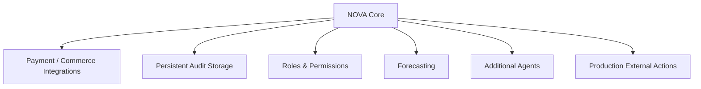

Potential extensions include:

- persistent audit storage
- richer approval roles
- production authentication
- deeper Razorpay/test-mode integrations
- more agent tools
- demand forecasting
- customer-level actions
- campaign orchestration
- additional commerce workflows

The core control model remains:

**Reason → Propose → Validate → Approve → Execute → Audit**

---

# ◈ 30 — PHILOSOPHY

> ## **Autonomy without accountability is not intelligence.**

NOVA is built around the belief that business AI should not merely generate answers.

It should help businesses:

**understand what is happening**

**understand why it is happening**

**decide what to do**

**act within boundaries**

**keep a human in control**

**and know exactly what happened afterward**

---

# ◈ NOVA

### Ask the business question.

### Let the agents reason.

### Keep the human in control.

### Turn decisions into accountable actions.

<p align="center">

**NOVA — AI Executive Intelligence for Agentic Commerce**

`REASON • PROPOSE • VALIDATE • APPROVE • EXECUTE • AUDIT`

</p>
